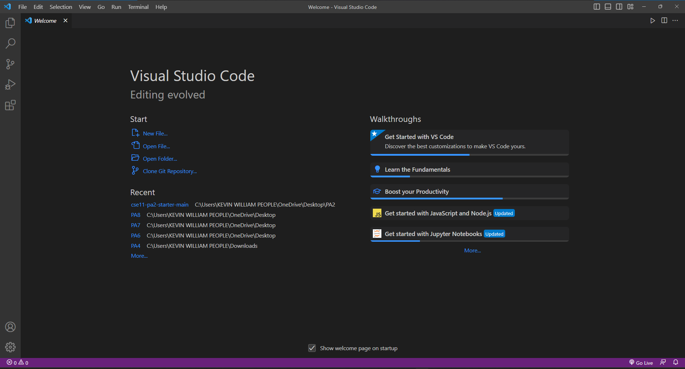
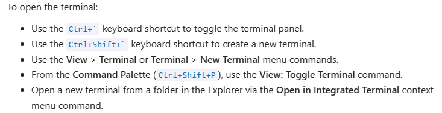
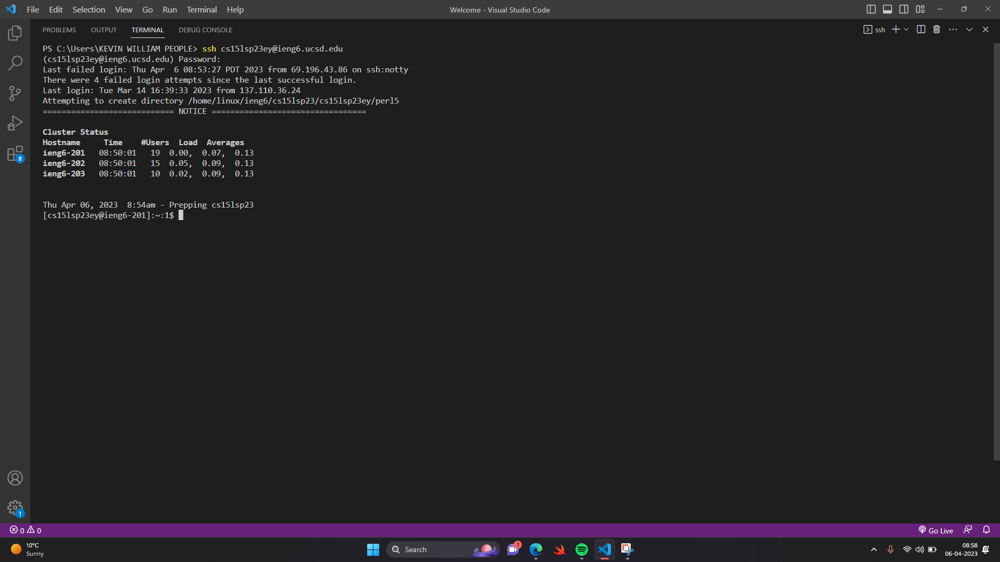
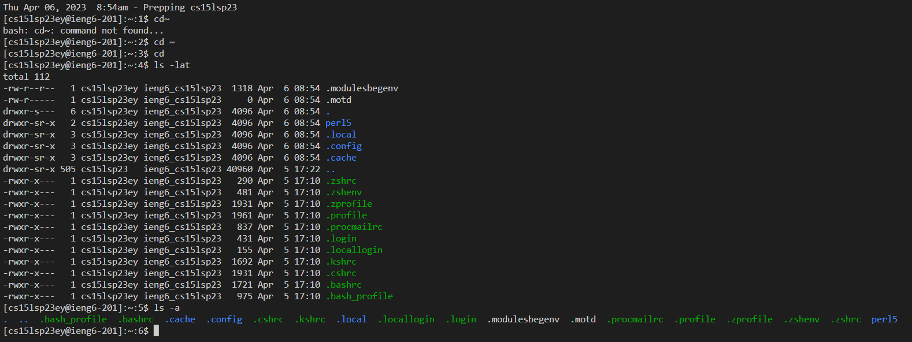

# **Lab Report 1**

Hello World!\
This tutorial will teach you the way to log into a course-specific account on **ieng6**. Simply follow the steps shown below and have fun :)

**Step1: Installing VScode**\
Visual Studio Code aka VScode is a code editor redefined and optimized for building and debugging modern web and cloud applications.\
Click on the given link to install VScode: 
[Download VScode](https://code.visualstudio.com/Download). 
After you visit the link,choose the suitable download option according to your OS.\
After installation is complete, open VScode and your screen should look like the image shown below.\

**Step2: Remotely Connecting**\
First of all you need to install **Git** by clicking on the link. 
You can also open the terminal on VScode which you just installed. Refer the following image

After connecting to the remote servers, your terminal should look like the image below :)

**Step3: Getting to know some commands**\
Following are some important commands which you can either execute on your system or on the remote system.

**Step4: Trying some commands**\
After executing these commands, your terminal should look like this :

You can look up for some more commands by clicking in the given link and try them out in your own!.

